# 🏢 NexusCommerce Backoffice Administration Panel


## 🌟 Overview

**NexusCommerce Backoffice** is a sophisticated, modern administrative dashboard built for managing the entire e-commerce ecosystem. This React-based application provides comprehensive tools for administrators, managers, and staff to efficiently operate and monitor the NexusCommerce platform with real-time analytics, intuitive interfaces, and powerful management capabilities.

## 🛠️ Technology Stack

<div align="center">

### Frontend Technologies


### Styling & UI


### Data Visualization


### Form Management


### Development Tools


### Backend Integration


</div>

## 🏗️ Application Architecture

```mermaid
graph TB
    subgraph "Frontend Layer"
        REACT[React 18<br/>TypeScript]
        ROUTER[React Router<br/>Navigation]
        CONTEXT[Context API<br/>State Management]
    end

    subgraph "UI Components Layer"
        subgraph "Chart Components"
            ADVANCED_CHARTS[Advanced Charts<br/>Real-time Analytics]
            APEX_CHARTS[ApexCharts<br/>Interactive Visualizations]
            CUSTOM_METRICS[Custom Metrics<br/>Business KPIs]
        end
        
        subgraph "Form Components"
            FORM_CONTROLS[Form Controls<br/>Input/Select/TextArea]
            FILE_UPLOAD[File Upload<br/>Drag & Drop]
            DATE_PICKER[Date Picker<br/>Flatpickr Integration]
            VALIDATION[Form Validation<br/>Real-time Feedback]
        end
        
        subgraph "Data Tables"
            PRODUCT_TABLE[Product Management<br/>CRUD Operations]
            INVENTORY_TABLE[Inventory Control<br/>Stock Management]
            ORDER_TABLE[Order Processing<br/>Status Tracking]
            USER_TABLE[User Administration<br/>Role Management]
        end
    end

    subgraph "Service Layer"
        AUTH_SERVICE[Authentication Service<br/>JWT + OAuth2]
        API_CLIENT[API Gateway Client<br/>HTTP + WebSocket]
        NOTIFICATION_SERVICE[Notification Service<br/>SSE + WebSocket]
        STATE_MGMT[State Management<br/>Context + Reducers]
    end

    subgraph "Backend Integration"
        API_GATEWAY[API Gateway<br/>:8099]
        MICROSERVICES[Microservices<br/>User/Product/Order/etc]
        REAL_TIME[Real-time Events<br/>Kafka + SSE]
        FILE_STORAGE[File Storage<br/>Assets + Documents]
    end

    %% Connections
    REACT --> ROUTER
    REACT --> CONTEXT
    ROUTER --> ADVANCED_CHARTS
    ROUTER --> FORM_CONTROLS
    ROUTER --> PRODUCT_TABLE
    
    CONTEXT --> AUTH_SERVICE
    CONTEXT --> API_CLIENT
    CONTEXT --> NOTIFICATION_SERVICE
    
    API_CLIENT --> API_GATEWAY
    NOTIFICATION_SERVICE --> REAL_TIME
    AUTH_SERVICE --> MICROSERVICES
    
    %% Styling
    classDef reactLayer fill:#e1f5fe,stroke:#01579b,stroke-width:3px
    classDef uiLayer fill:#f3e5f5,stroke:#4a148c,stroke-width:2px
    classDef serviceLayer fill:#e8f5e8,stroke:#1b5e20,stroke-width:2px
    classDef backendLayer fill:#fff3e0,stroke:#e65100,stroke-width:2px
    
    class REACT,ROUTER,CONTEXT reactLayer
    class ADVANCED_CHARTS,FORM_CONTROLS,PRODUCT_TABLE,APEX_CHARTS,FILE_UPLOAD,INVENTORY_TABLE uiLayer
    class AUTH_SERVICE,API_CLIENT,NOTIFICATION_SERVICE,STATE_MGMT serviceLayer
    class API_GATEWAY,MICROSERVICES,REAL_TIME,FILE_STORAGE backendLayer
```



## 🎯 Core Features & Modules

### 📊 **Analytics Dashboard**
- **Real-time Metrics**: Live business KPIs with auto-refresh
- **Advanced Charts**: Line charts, bar charts, donut charts with animations
- **Custom Visualizations**: Interactive data exploration tools
- **Performance Monitoring**: Service health and response time tracking
- **Export Capabilities**: PDF/Excel reports generation

### 👥 **User Management**
- **User Profiles**: Comprehensive user information management
- **Role-Based Access Control**: Granular permission system
- **Authentication**: JWT + OAuth2 integration
- **Profile Editing**: In-place editing with modal interfaces
- **Activity Tracking**: User session and action logging

### 📦 **Product Management**
- **Product Catalog**: Complete product lifecycle management
- **Inventory Control**: Real-time stock level monitoring
- **Bulk Operations**: Mass product updates and imports
- **Image Management**: Multi-image upload with preview
- **Category Management**: Hierarchical product organization

### 📋 **Order Processing**
- **Order Dashboard**: Real-time order status tracking
- **Workflow Management**: Automated order processing pipelines
- **Payment Integration**: Payment status and refund management
- **Shipping Coordination**: Carrier integration and tracking
- **Customer Communication**: Automated notifications

### 🔔 **Notification System**
- **Real-time Notifications**: SSE-powered instant alerts
- **Multi-channel Delivery**: In-app, email, SMS notifications
- **Notification History**: Complete audit trail
- **Custom Templates**: Rich notification formatting
- **Subscription Management**: User preference controls

### 📈 **Inventory Management**
- **Stock Monitoring**: Real-time inventory levels
- **Low Stock Alerts**: Automated reorder notifications
- **Warehouse Management**: Multi-location inventory tracking
- **Stock Adjustments**: Manual and automated stock corrections
- **Reporting**: Comprehensive inventory analytics

## 🚀 Quick Start

### Prerequisites


```bash
node --version    # v18.0.0 or higher
npm --version     # 8.0.0 or higher
```

### Installation

1. **Clone the Repository**
   ```bash
   git clone https://github.com/ZakariaRek/Ecommerce-App.git
   cd Ecommerce-App/nexus-backoffice
   ```

2. **Install Dependencies**
   ```bash
   npm install
   # or
   yarn install
   ```

3. **Environment Configuration**
   ```bash
   cp .env.example .env.local
   ```
   
   Configure your environment variables:
   ```env
   # API Configuration
   VITE_API_BASE_URL=http://localhost:8099
   VITE_API_GATEWAY_URL=http://localhost:8099/api
   
   # Authentication
   VITE_JWT_SECRET=your-jwt-secret-key
   VITE_OAUTH_CLIENT_ID=your-oauth-client-id
   
   # Real-time Features
   VITE_WEBSOCKET_URL=ws://localhost:8099/ws
   VITE_SSE_URL=http://localhost:8099/sse
   
   # Feature Flags
   VITE_ENABLE_ANALYTICS=true
   VITE_ENABLE_REAL_TIME_NOTIFICATIONS=true
   VITE_ENABLE_DARK_MODE=true
   
   # Development
   VITE_APP_ENV=development
   VITE_LOG_LEVEL=debug
   ```

4. **Start Development Server**
   ```bash
   npm run dev
   # or
   yarn dev
   ```

5. **Access the Application**
   - **Development Server**: http://localhost:5173
   - **API Gateway**: http://localhost:8099
   - **Storybook**: http://localhost:6006 (if enabled)


## 🎨 UI Component Library

### 📊 **Chart Components**

#### Advanced Line Chart
```typescript
import { AdvancedLineChart } from '@/components/Analytics/ChartComponents';

<AdvancedLineChart
  data={chartData}
  width={800}
  height={400}
  color="#667eea"
  showGrid={true}
  showDots={true}
  animate={true}
  title="Sales Performance"
  yAxisLabel="Revenue ($)"
  xAxisLabel="Time Period"
/>
```

#### Advanced Bar Chart
```typescript
import { AdvancedBarChart } from '@/components/Analytics/ChartComponents';

<AdvancedBarChart
  data={barData}
  width={600}
  height={300}
  color="#667eea"
  horizontal={false}
  showValues={true}
  animate={true}
  title="Monthly Sales"
/>
```

#### Advanced Donut Chart
```typescript
import { AdvancedDonutChart } from '@/components/Analytics/ChartComponents';

<AdvancedDonutChart
  data={donutData}
  width={300}
  height={300}
  showLabels={true}
  showPercentages={true}
  animate={true}
  title="Market Share"
  innerRadius={0.6}
  centerText="Total Sales"
/>
```

### 📋 **Form Components**

#### Input Field with Validation
```typescript
import Input from '@/components/form/input/InputField';

<Input
  type="email"
  placeholder="Enter email"
  value={email}
  onChange={handleEmailChange}
  error={hasError}
  success={isValid}
  hint="Please enter a valid email address"
/>
```

#### File Upload with Drag & Drop
```typescript
import FileInput from '@/components/form/input/FileInput';

<FileInput
  onChange={handleFileChange}
  accept="image/*"
  multiple={true}
  className="custom-file-input"
/>
```

#### Date Picker
```typescript
import DatePicker from '@/components/form/date-picker';

<DatePicker
  id="date-picker"
  label="Select Date"
  placeholder="Choose a date"
  mode="single"
  onChange={handleDateChange}
/>
```

### 🗃️ **Data Tables**

#### Product Management Table
```typescript
import ProductList from '@/components/tables/Product/ProductList';

<ProductList />
```

#### Inventory Management Table
```typescript
import InventoryList from '@/components/tables/Product/InventoryTable';

<InventoryList />
```

### 🔔 **Notification System**

#### Notification Dropdown
```typescript
import NotificationDropdown from '@/components/header/NotificationDropdown';

<NotificationDropdown
  userId={currentUserId}
  maxNotifications={50}
  enableSound={true}
  enableBrowserNotifications={true}
  onNotificationReceived={handleNotification}
/>
```

## 🔐 Authentication & Security

### JWT Authentication Flow

```typescript
// Authentication Context
const authContext = {
  user: User | null,
  isAuthenticated: boolean,
  isLoading: boolean,
  login: (credentials: LoginCredentials) => Promise<AuthResult>,
  logout: () => void,
  refreshToken: () => Promise<void>
}

// Usage in components
const { user, isAuthenticated, login, logout } = useAuth();
```

### Protected Routes
```typescript
import ProtectedRoute from '@/components/ProtectedRoute';

<ProtectedRoute>
  <AdminDashboard />
</ProtectedRoute>
```

### Role-Based Access Control
```typescript
// Permission checking
const hasPermission = (user: User, permission: Permission) => {
  return user.roles.some(role => 
    role.permissions.includes(permission)
  );
};

// Usage in components
{hasPermission(user, 'MANAGE_PRODUCTS') && (
  <ProductManagementPanel />
)}
```

## 🌐 API Integration

### API Service Configuration
```typescript
// API Client setup
const apiClient = axios.create({
  baseURL: import.meta.env.VITE_API_BASE_URL,
  timeout: 10000,
  headers: {
    'Content-Type': 'application/json',
  },
});

// Request interceptor for authentication
apiClient.interceptors.request.use((config) => {
  const token = getAuthToken();
  if (token) {
    config.headers.Authorization = `Bearer ${token}`;
  }
  return config;
});
```

### Service Examples

#### Product Service
```typescript
export class ProductService {
  static async getAllProducts(): Promise<Product[]> {
    const response = await apiClient.get('/products');
    return response.data;
  }

  static async createProduct(product: CreateProductRequest): Promise<Product> {
    const response = await apiClient.post('/products', product);
    return response.data;
  }

  static async updateProduct(id: string, product: UpdateProductRequest): Promise<Product> {
    const response = await apiClient.put(`/products/${id}`, product);
    return response.data;
  }
}
```

#### Notification Service
```typescript
export class NotificationService {
  static connectToSSE(userId: string, onMessage: (notification: Notification) => void) {
    const eventSource = new EventSource(`/sse/connect/${userId}`);
    
    eventSource.onmessage = (event) => {
      const notification = JSON.parse(event.data);
      onMessage(notification);
    };
    
    return eventSource;
  }

  static async markAsRead(notificationId: string): Promise<void> {
    await apiClient.put(`/notifications/${notificationId}/read`);
  }
}
```

## 📊 Real-time Features

### Server-Sent Events (SSE)
```typescript
// SSE Connection Hook
const useSSENotifications = (userId: string) => {
  const [notifications, setNotifications] = useState<Notification[]>([]);
  
  useEffect(() => {
    const eventSource = NotificationService.connectToSSE(
      userId,
      (notification) => {
        setNotifications(prev => [notification, ...prev]);
      }
    );
    
    return () => eventSource.close();
  }, [userId]);
  
  return notifications;
};
```

### WebSocket Integration
```typescript
// WebSocket Service
export class WebSocketService {
  private ws: WebSocket | null = null;
  
  connect(url: string) {
    this.ws = new WebSocket(url);
    
    this.ws.onopen = () => {
      console.log('WebSocket connected');
    };
    
    this.ws.onmessage = (event) => {
      const data = JSON.parse(event.data);
      this.handleMessage(data);
    };
  }
  
  send(message: any) {
    if (this.ws?.readyState === WebSocket.OPEN) {
      this.ws.send(JSON.stringify(message));
    }
  }
}
```

## 🎨 Theming & Styling

### Dark Mode Support
```typescript
// Theme Context
const ThemeContext = createContext({
  theme: 'light' | 'dark',
  toggleTheme: () => void
});

// Usage
const { theme, toggleTheme } = useTheme();
```

### Tailwind Configuration
```javascript
// tailwind.config.js
module.exports = {
  content: ['./src/**/*.{js,ts,jsx,tsx}'],
  darkMode: 'class',
  theme: {
    extend: {
      colors: {
        brand: {
          50: '#eff6ff',
          500: '#3b82f6',
          600: '#2563eb',
          700: '#1d4ed8',
        },
        success: {
          50: '#f0fdf4',
          500: '#22c55e',
          600: '#16a34a',
        },
        error: {
          50: '#fef2f2',
          500: '#ef4444',
          600: '#dc2626',
        },
      },
    },
  },
  plugins: [],
};
```

## 🧪 Testing

### Test Configuration
```bash
# Run all tests
npm run test

# Run tests in watch mode
npm run test:watch

# Run tests with coverage
npm run test:coverage

# Run E2E tests
npm run test:e2e
```

### Component Testing Example
```typescript
import { render, screen, fireEvent } from '@testing-library/react';
import { Button } from '@/components/ui/button/Button';

describe('Button Component', () => {
  test('renders button with text', () => {
    render(<Button>Click me</Button>);
    expect(screen.getByText('Click me')).toBeInTheDocument();
  });

  test('calls onClick handler when clicked', () => {
    const handleClick = jest.fn();
    render(<Button onClick={handleClick}>Click me</Button>);
    
    fireEvent.click(screen.getByText('Click me'));
    expect(handleClick).toHaveBeenCalledTimes(1);
  });
});
```

## 📦 Build & Deployment

### Development Build
```bash
npm run dev          # Start development server
npm run build        # Create production build
npm run preview      # Preview production build
npm run lint         # Run ESLint
npm run type-check   # TypeScript type checking
```

### Production Deployment
```bash
# Build for production
npm run build

# Build output will be in 'dist' folder
# Deploy to your preferred hosting platform
```

### Docker Deployment
```dockerfile
# Dockerfile
FROM node:18-alpine AS builder

WORKDIR /app
COPY package*.json ./
RUN npm ci --only=production

COPY . .
RUN npm run build

FROM nginx:alpine
COPY --from=builder /app/dist /usr/share/nginx/html
COPY nginx.conf /etc/nginx/nginx.conf

EXPOSE 80
CMD ["nginx", "-g", "daemon off;"]
```

### Environment-Specific Builds
```bash
# Development
npm run build:dev

# Staging
npm run build:staging

# Production
npm run build:prod
```

## 🔧 Development Workflow

### Code Quality Standards
```bash
# Linting
npm run lint
npm run lint:fix

# Formatting
npm run format
npm run format:check

# Type checking
npm run type-check
```

### Git Hooks
```json
// package.json
{
  "husky": {
    "hooks": {
      "pre-commit": "lint-staged",
      "commit-msg": "commitlint -E HUSKY_GIT_PARAMS"
    }
  },
  "lint-staged": {
    "*.{ts,tsx}": [
      "eslint --fix",
      "prettier --write",
      "git add"
    ]
  }
}
```

### Commit Convention
```bash
# Feature
git commit -m "feat: add user profile management"

# Bug fix
git commit -m "fix: resolve chart rendering issue"

# Documentation
git commit -m "docs: update API integration guide"

# Style
git commit -m "style: improve button component design"

# Refactor
git commit -m "refactor: optimize notification service"
```

## 📈 Performance Optimization

### Code Splitting
```typescript
// Lazy loading for route components
const Dashboard = lazy(() => import('@/pages/Dashboard'));
const ProductManagement = lazy(() => import('@/pages/ProductManagement'));
const UserManagement = lazy(() => import('@/pages/UserManagement'));

// Usage with Suspense
<Suspense fallback={<LoadingSpinner />}>
  <Dashboard />
</Suspense>
```

### Bundle Analysis
```bash
# Analyze bundle size
npm run build
npm run analyze

# Lighthouse performance audit
npm run lighthouse
```

### Optimization Techniques
- **Code Splitting**: Lazy loading for routes and components
- **Image Optimization**: WebP format with fallbacks
- **Caching**: Service worker for static assets
- **Tree Shaking**: Remove unused code
- **Compression**: Gzip/Brotli compression
- **CDN Integration**: Static asset delivery

## 🤝 Contributing

### Development Setup
1. Fork the repository
2. Create a feature branch: `git checkout -b feature/amazing-feature`
3. Install dependencies: `npm install`
4. Start development server: `npm run dev`
5. Make your changes
6. Run tests: `npm run test`
7. Commit changes: `git commit -m 'feat: add amazing feature'`
8. Push to branch: `git push origin feature/amazing-feature`
9. Open a Pull Request

### Contribution Guidelines
- Follow the established coding standards
- Write tests for new features
- Update documentation as needed
- Ensure all tests pass
- Follow semantic versioning

### Code Review Process
1. **Automated Checks**: CI/CD pipeline runs linting, tests, and builds
2. **Peer Review**: At least one team member reviews the code
3. **QA Testing**: Manual testing on staging environment
4. **Approval**: Code review approval and merge

## 📚 Documentation

### Storybook Integration
```bash
# Start Storybook
npm run storybook

# Build Storybook
npm run build-storybook
```

### API Documentation
- **Swagger UI**: Available at `http://localhost:8099/swagger-ui.html`
- **Postman Collection**: Import from `/docs/api/postman-collection.json`
- **API Reference**: Detailed documentation in `/docs/api/`

### Architecture Documentation
- **System Design**: `/docs/architecture/system-design.md`
- **Component Library**: `/docs/components/component-library.md`
- **API Integration**: `/docs/api/integration-guide.md`
- **Deployment Guide**: `/docs/deployment/deployment-guide.md`

## 🔍 Troubleshooting

### Common Issues

#### Build Issues
```bash
# Clear node modules and reinstall
rm -rf node_modules package-lock.json
npm install

# Clear Vite cache
npm run dev -- --force
```

#### Authentication Issues
```bash
# Check API Gateway connectivity
curl -X GET http://localhost:8099/api/health

# Verify JWT token
# Check browser Developer Tools > Application > Local Storage
```

#### Styling Issues
```bash
# Rebuild Tailwind CSS
npm run build-css

# Check for conflicting styles
# Use browser Developer Tools to inspect elements
```

## 📞 Support & Resources

### 🔗 **Quick Links**
- **Live Demo**: [https://nexus-backoffice.demo.com](https://nexus-backoffice.demo.com)
- **API Documentation**: [http://localhost:8099/swagger-ui.html](http://localhost:8099/swagger-ui.html)
- **Storybook**: [http://localhost:6006](http://localhost:6006)
- **Issue Tracker**: [GitHub Issues](https://github.com/ZakariaRek/Ecommerce-App/issues)

### 📧 **Contact Information**
- **Email**: support@nexuscommerce.io
- **Slack**: #nexus-backoffice-support
- **Documentation**: [docs.nexuscommerce.io](https://docs.nexuscommerce.io)

### 🎓 **Learning Resources**
- **Component Library Guide**: `/docs/components/`
- **API Integration Tutorial**: `/docs/tutorials/api-integration.md`
- **Theming Guide**: `/docs/theming/customization.md`
- **Performance Best Practices**: `/docs/performance/optimization.md`

## 📜 License

This project is licensed under the MIT License - see the [LICENSE](LICENSE) file for details.

## 🙏 Acknowledgments

- **React Team**: For the amazing React ecosystem
- **Tailwind CSS**: For the utility-first CSS framework
- **Vite**: For the lightning-fast build tool
- **Chart.js & ApexCharts**: For powerful data visualization
- **TypeScript**: For type safety and developer experience

---

> "Great interfaces are invisible. They don't get in the way of the user's goals - they enable them. NexusCommerce Backoffice is designed to be that invisible bridge between complex business operations and intuitive management experiences."

<div align="center">
  <strong>Built with ❤️ by the NexusCommerce Team</strong>
</div>
